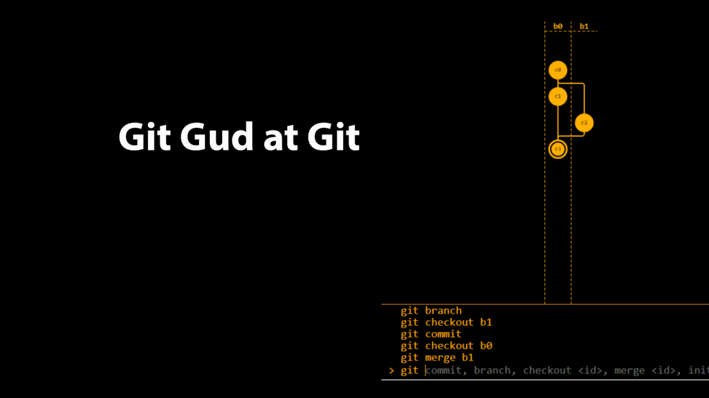
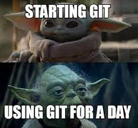

# Work with Git

## 1. Check installed Git
**Execute** command  `git version`  in terminal 

Show message with version info if Git is installed.
Else show error message.

## 2. Git installation
Download last version of Git from https://git-scm.com/downloads. Install with default settings.
## 3. Git settings
For first use must be set up name and email by commands:
```
git config --global user.name* "Your's name"
git config --global user.email
your email "example@xxx.com"
```
## 4. Git common commands
`git init` -  local repository initialization 

`git status` - get information of git status

`git add` - add file or files to the next commit

`git commit -m "message"` - create commit

`git log` - history of commits with hash codes

`git checkout` - transition from one commit to another

`git checkout master` - back to actual state and continue working

`git diff` - difference between current and commited file


## 5 Markdown syntax

`# Headline` - Highlighted headlines. Number of symbols "#" set level of headline (support 6 levels)

`= or -` underline with this symbols (at least 3 in a row) highlight headings first ("=") and second ("-") levels

`**Half bold text**`   or "__ example __" __example__

`***Italics***` or "_ example _" _example_

`~~Strikethrough text~~`

`* String` - unordered lists, symbol "*" at start of string

`1,2,3 ...` - unordered lists

## 6 Ignoring files
In order to exclude files or folders from repository tracking, you need to create a file ***.gitignore*** and write into it their names or patterns corresponding to such files or folders

## 7 Creating git branches

A branch in git is simply a movable pointer to one of the commits, usually the last one in a chain of commits.
By default, the master branch name in git is *master*.

You can create a branch with the command:
```
git branch <name of new branch>
```
As a result, a new pointer to the current commit is created
The list of branches in the repository can be viewed using the command
```
git branch
```
The current branch will be marked with an asterisk: **\*master**

## 8 Merging branches and resolving conflicts


To merge the selected branch with the current one, execute the command:
```
git merge <selected branch name>
```
If the same part of the file was changed in both branches, then a conflict may arise that will require user participation

## 9 Work with remote repositories
`git clone <url-address>` -  cloning an external repository to a local PC

`git pull` -  receiving changes and merging with local version 

`git push` - sends the local version of the repository to an external one

##  P.S. - Ty for reading

